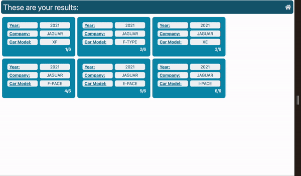

# car-dealer-app
An application to search cars made by year and manufacturer.

## Set up project
Project runs with node 18. You can install nvm 'curl -o- https://raw.githubusercontent.com/nvm-sh/nvm/v0.39.5/install.sh'
Check if nvm is installe by restarting the terminal configuration and runnin nvm --version
check available node version running 'nvm -ls'
If no v18 found, then run 'nvm install 18', finally 'nvm use 18'.

Once in the root of the project run 'node intall' followed by 'npm run dev'.

This commando should start the app in development mode.
If no styles are being rendered, then finish the running programm and run 'npm run tw:build' to build css styles again.
Then run again 'npm run dev'.

You can also run 'npm run build' to see dynamic and static pages generated, then run 'npm run start' to run in production mode.

## App Demos
Navigatin through pages with loader:
    

Rendering pages not found and handling errors:
    

    note: In error page there is a reset params receive that allows user to try again failed request, in my example doesn't work because fetch part of the code commented.